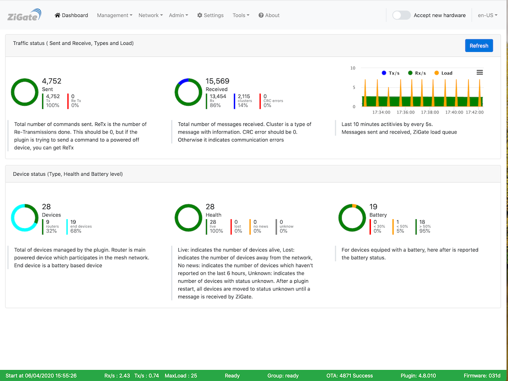

# Configuration du plugin

Cette étape est la troisième étape du procsssus d'installation du plugin Zigate.

Vous devez donc avoir suivi et terminé l'[étape 1 Installation](Installation.md) et l'[étape 2 Paramétrage](Parametrage.md)

## Accéder à l'interface d'aministration

L'interface d'administration vous donne acceder aux éléments suivants :
- Un tableau de bord synthétique
- La gestion des dispositifs et des groupes
- La visualisation de la topologie et la qualité du reseau ZigBee
- Un jeu de commandes permettant d'administrer la ZiGate, le plugin et les dispositifs
- La configuration du plugin
- Un jeu d'outils permettant le debug, la gestion des erreurs et l'interaction directe avec les dispositifs.

Vous pouvez accéder à l'interface web d'administration en allant à la page http://IP-serveur-domoticz:numéro-de-port-défini-dans-paramétrage.

Si votre DomoticZ est sur un serveur en local et que vous avez laisser le port par défaut, l'adresse de l'interface web est http://127.0.0.1:9440

Pour des raisons de sécurité, **ne pas présenter le port 9440 sur votre réseau externe** sous peine d'ouvrir à tous la gestion de votre domotique.

