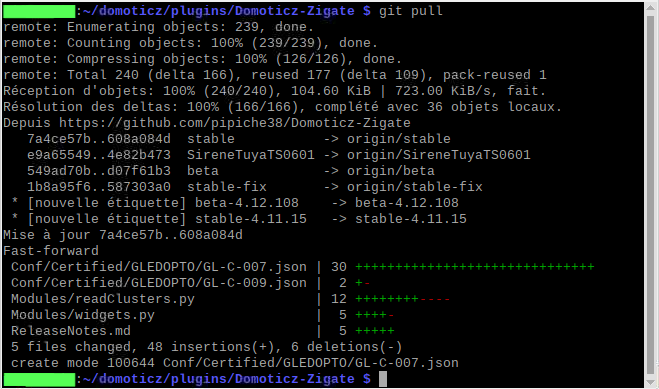

# Les mises à jour et les branches

## Mettre à jour le plugin

Le plugin est régulièrement mis à jour que ce soit pour de la correction de bug ou l'ajout de nouvelle fonctionnalités.


### Procédure

* Ouvrir un terminal et aller jusqu'au répertoire du plugin ZiGate (généralement c'est '/home/pi/domoticz/plugins/Domoticz-Zigate')

* Lancer la commande `git pull`

Les informations de mise à jour sont affichées comme dans l'exemple  ci-dessous :



* Exécuter ensuite : `sudo chmod +x plugin.py`

* Redémarrer DomoticZ


### En cas d'erreurs


Il peut y avoir des fichiers dont les droits ont changés. Dans ce cas, faire les commandes suivantes :

```
  git reset –-hard
  git pull --force
 ```

## Les branches de mise à jour


Le plugin évolue en permanence suite à la correction de bug, l'amélioration du plugin ou l'ajout de nouveaux objets. Afin d'éviter un maximum de bug, le code du plugin est disponible sous différents canaux de mise à jour.
Au fur et à mesure des évolutions de DomoticZ, le plugin se doit d'évoluer et, malheureusement, il n'est pas possible de conserver une compatibilité du plugin avec toutes les versions antérieurs de DomoticZ. C'est pourquoi à partir de la version 5 (mai 2021), une branche __stable5__ est crée pour conserver la branche __stable__ compatible avec les anciennes versions.

Au fur et à mesure des évolutions de DomoticZ, le plugin se doit d'évoluer et, malheureusement, il n'est pas possible de conserver une compatibilité du plugin avec toutes les versions antérieurs de DomoticZ. C'est pourquoi à partir de la version 5 (mai 2021), une branche __stable5__ est crée pour conserver la branche __stable__ compatible avec les anciennes versions.

Les différentes branches sont :

#### stable5

C'est la version par défaut actuelle, compatible avec la ZiGate+ (V2)
<<<<<<< HEAD

| Info  | Compatibilité  |
| :------------: |:---------------:|
| Modèles de ZiGate | V1 et V2 |
| Compatibilité minimale | DomoticZ 2020.1 |
| Compatibilité maximale | Dernière version de DomoticZ* |

*Sous réserve d'une mauvaise surprise lors de la sortie d'une nouvelle version.

=======

| Info  | Compatibilité  |
| :------------: |:---------------:|
| Modèles de ZiGate | V1 et V2 |
| Compatibilité minimale | DomoticZ 2020.1 |
| Compatibilité maximale | Dernière version de DomoticZ* |

*Sous réserve d'une mauvaise surprise lors de la sortie d'une nouvelle version.

>>>>>>> c8807b5e3621322980788fc4db13d7a6c373858e
#### stable

C'était la version par défaut jusqu'au moment de la sortie de la ZiGate V1.
Sa compatibilité s'arrête avec DomoticZ 2020.2.

| Info  | Compatibilité  |
| :------------: |:---------------:|
| Modèles de ZiGate | V1 |
| Compatibilité minimale | DomoticZ 4.97 |
| Compatibilité maximale | DomoticZ 2020.2 |

Cette version ne recevra plus de mise à jour.

#### beta

La branche Béta est le canal de développement. __Ne passez pas sur la branche beta sans y avoir été invité.__

Si vous êtes sur la branche __beta__ (suite à l'ajout d'un nouveau matériel par exemple), vous pouvez repasser sur la branche __stableX__ à la prochaine mise à jour du canal __stableX__.

| Info  | Compatibilité  |
| :------------: |:---------------:|
| Modèles de ZiGate | V1 et V2 |
| Compatibilité minimale | DomoticZ 2020.1 |
| Compatibilité maximale | Dernière version de DomoticZ* |

#### stableX-fix

La branche stableX-fix (avec un numéro à la place du X) est l'anti-chambre de la branche stableX. En gros les bug-fix sont réalisées sur celle-ci avant d'être envoyer sur la branche stableX. Il n'y a pas de gestion de version sur cette branche !

__Ne passez pas sur la branche stableX-fix sans y avoir été invité.__

Si vous êtes sur la branche __stableX-fix__ (suite à l'ajout d'un nouveau matériel par exemple), vous pouvez repasser sur la branche __StableX__ à la prochaine mise à jour du canal __StableX__.

| Info  | Compatibilité  |
| :------------: |:---------------:|
| Modèles de ZiGate | V1 et V2 |
| Compatibilité minimale | DomoticZ 2020.1 |
| Compatibilité maximale | Dernière version de DomoticZ* |


### Connaître sa branche


* Ouvrir un terminal et aller jusqu'au répertoire du plugin ZiGate (généralement c'est '/home/pi/domoticz/plugins/Domoticz-Zigate')
* Lancer la commande `git status`


### Passer d'une branche à l'autre

Il est recommandé des faire une [sauvegarde](Plugin_Sauvegardes.md) avant de faire des modifications afin de pouvoir revenir en arrière en cas de problèmes.

* Ouvrir un terminal et aller jusqu'au répertoire du plugin ZiGate (généralement c'est '/home/pi/domoticz/plugins/Domoticz-Zigate')

* Lancer la commande `git pull`

* Lancer la commande `git checkout stable5` pour aller sur le canal stable5
* Lancer la commande `git checkout stable` pour aller sur le canal stable
* Lancer la commande `git checkout stable5-fix` pour aller sur le canal stable5-fix
* Lancer la commande `git checkout beta` pour aller sur le canal beta

__Attention aux compatibilités avec DomoticZ lors du changement de branche.__

[Poursuivre sur la mise à jour du plugin](Home.md#mises-%C3%A0-jour-du-plugin)
