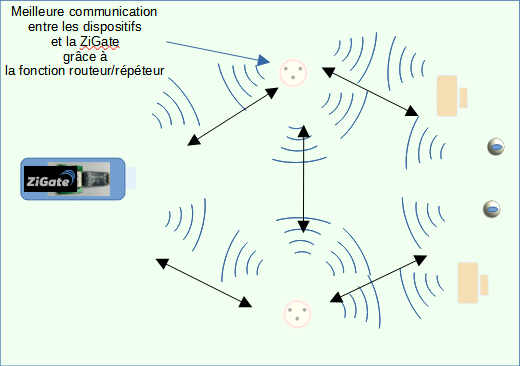
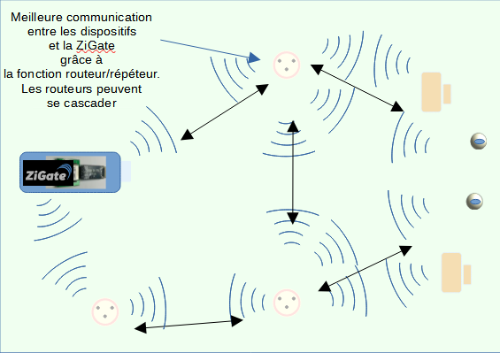

# Comment construire/maintenir un bon réseau maillé Zigbee

## Comment construire votre réseau Zigbee (et le maintenir)

Si vous utilisez des objets Zigbee, vous devez comprendre que le réseau maillé Zigbee est la pierre angulaire de votre domotique.
Ce réseau maillé permet aux objets Zigbee de communiquer entre eux et avec la passerelle Zigbee (ZiGate). Bien que les objets construisent automatiquement le maillage, cette opération n'est pas instantannée. Il est donc nécessaire d'attendre que le réseau s'élabore avant de commencer à automatiser vos objets.
En automatisant trop précipitamment, vous risquez, notamment, d'etre confronté à des pertes de objets.

**A noter :** La constitution de votre maillage Zigbee peut prendre plusieurs jours afin de trouver les routes optimales, cependant en stoppant le module central (ZiGate) durant 20 minutes, vous relancez le process de re-découverte du maillage réseau.

Pour disposer, tous les objets Zigbee doivent etre accessibles de la ZiGate. En ajoutant les objets à proximité de votre ZiGate (routeur principal), puis en le déplaçant à l'emplacement final conduit souvent à une perte du objet au sein du réseau. Il est donc recommandé de toujours appairer vos objets depuis leur emplacement final.

Même si votre Zigate supporte jusqu'à 40 objets connectés directement, un ou plusieurs objets router contribueront à maintenir une bonne communication entre les objets et la Zigate. Considerons votre environnement! La distance avec les objets les plus éloignés, les obstructions du signal (murs épais, zones metalliques, etc...) et la performance intrinsèque du objet vont déterminer le nombre de objet router nécessaire pour un bon maillage.
Un router Zigbee est un objet alimenté sur le secteur, généralement des prises (plug) ou interrupteurs (wall switches). Par conséquent les objets Zigbee alimentés sur baterie ne permettent pas de repeter le signal Zigbee, ils sont designés en tant que objets terminaux (end devices) à contrario des routeurs qui eux repetent le signal Zigbee.

Voici quelques procédures à suivre lors de la découverte des objets Zigbee pour constituer un réseau solide... La patience reste la clef du succès.

### Jusqu'à 40 objets alimentés sur batterie
1. Faites l'appairage de vos objets l'un après l'autre; attendez la fin de l'appairage de l' objet pour tenter l'appairage du suivant. Voir les intructions d'appairage propres à votre materiel pour plus de détail.
2. La distance entre le objet et la ZiGate mais également les matériaux de construction (murs), les objets métalliques et les performances du composant vont déterminer l'éloignement maximum du objet sans perte de connexion avec la Zigate

### Au delà de 40 objets
La ZiGate supporte jusqu'à 40 objets en connexion directe. Vous pouvez étendre cette limitation en utilisant les objets alimentés sur le secteur disposant de la fonction répéteur/routeur; on appelle ces objets, des objets routeurs.
Les objets connectés alimentés sur batterie n'écoutent pas le réseau Zigbee et de ce fait ne peuvent exercer une fonction de routeur; on appelle aussi ces objets des objets terminaux.
Les objets terminaux ne communiquent qu'avec un parent qui peut être soit la ZiGate elle même ou bien un objet routeur. Les objets routeurs, quant à eux, communiquent avec la ZiGate et les objets terminaux.
Bien entendu, votre environnement, la distance entre la ZiGate et le plus éloigné des objets, le nombre d'objets routeurs intégrés dans votre réseau va déterminer le nombre maximun d'objets que pourra contenir votre réseau ZigBee sous réserve d'avoir suffisament d'objets routeur correctement répartis en distance avec la ZiGate mais également entre eux.

### La construction du réseau
Appairer vos objets routeur l'un après l'autre; même si cela peut vous paraitre long (journée), stabilisez votre réseau entre chaque appairage. Une fois tous les objets routeur appairés et le réseau Zigbee stabilisé, vous pouvez alors commencer l'appairage des objets terminaux

Quand tous vos objets sont appairés, arrêtez votre ZiGate durant une vingtaine de minutes. Après ce délai, redemarrez votre ZiGate alors le maillage Zigbee choisira la meilleur route pour interconnecter les objets en 24h environ. Si vous ne souhaitez pas ou pouvez pas arrêter/redémarrer votre ZiGate vous pouvez attendre plusieurs jours (2-3j) pour que le réseau maillé établisse les meilleures routes entre votre ZiGate et les objets connectés.

## Comment fonctionnent les routeurs Zigbee ?
Les routeurs Zigbee (ou répéteur) relaient les informations entre la ZiGate et l'objet destination en assurant la transmission (validation de réception).
Comme mentionné plus haut, un routeur est un objet connecté qui tire son alimentation du secteur (220v pour la France); attention, cependant avec les ampoules qui peuvent etre egalement routeurs (voir la section [Astuces](#astuces-pour-créer-un-réseau-maillé-zigBee) pour un bon réseau maillé Zigbee). Par exemple, les prises Zigbee qui agissent en routeur, en relai, vers les objets qui sont trop éloignés de la ZiGate permettent de fiabiliser l'emmission et la réception du signal.
Zigbee et Z-Wave sont deux protocoles de communication sans fil très differents; ainsi avec le Zigbee, seuls les objects alimentés sur secteur ont une fonction routeur/répéteur vers les autres objets alors qu'avec le Z-Wave les objets se comportent tous en routeur vers tous les autres objets Z-Wave.

Des objets trop éloignés de la ZiGate ou génés par des interférences générent des pertes de connexion liées à un signal Zigbee trop faible.

Quand un router/répéteur est positionné entre un objet terminal et la ZiGate, l'objet terminal communique avec le routeur/répéteur et celui-ci communique avec la ZiGate améliorant ainsi très significativement  les performance et la fiabilité du signal.

Les routeurs ont la possibilité de communiquer, non seulement avec les objets terminaux mais également entre eux afin de constituter un puissant et stable réseau maillé Zigbee.

Les objets alimentés sur batterie doivent toujours avoir un parent avec lequel communiquer : c'est soit la ZiGate, soit un objet routeur/répéteur. Lorsqu'un objet rejoint pour la premiere fois le réseau Zigbee, il choisira le parent qui offre la meilleure qualité de signal. Une fois le parent choisi, il reste attaché à ce parent jusqu'à ce qu'il n'y ait plus aucune communication possible : la relation entre le parent et l'objet est exclusive, même si un autre parent nouvellement introduit dans le réseau offre un meilleur signal. C'est seulement lorsque la communication entre l'objet et le parent est rompue sur une longue periode que l'objet va sélectionner un nouveau parent. Cependant, si l'objet arrive à communiquer, meme occasionellement avec la ZiGate, il ne sélectionnera pas un nouveau parent.

Comme nous l'avons vus, les objets Zigbee attendent que la communication soit complètement perdue avec leur parent pour en rechercher un nouveau. Vous pouvez, cependant, accélérer ce processus en arretant la ZiGate durant 20 minutes puis la redémarrer. Quand la ZiGate redémarre les objets routeurs et les objets terminaux etablieront la communication entre eux en choisissant le chemin réseau optimum. Selon la complexité de votre configuration, comptez jusqu'à 24h pour que ce processus soit terminé.

## Astuces pour créer un réseau maillé ZigBee
Bien que le maillage Zigbee etabliera le chemin optimal pour une communication stable dans le temps des objets avec la ZiGate, il y a quelques recommandations à suivre pour optilmiser votre réseau et ainsi avoir les meilleurs résultats.

1. Positionner votre ZiGate à un emplacement central dans votre logement; ceci permettra à votre ZiGate de rayonner sur tout le logement en limitant les interferences avec l'ensemble des objets (routeurs ou terminaux). Eviter les coins extremité du logement, la cave, le garage ou les endroits avec beaucoup de grosses pieces metalliques (plaques, tuyaux, ...) qui vont génerer des interférences
Si votre routeur se situe à une extrémité de votre logement, essayer de positionner votre ZiGate sur un emplacement central au travers de cable ethernet ou CPL.

2. La distance maximum entre la ZiGate et les objets Zigbee est dépendante de l'environnement, des objets terminaux et de la puissance des objets routeurs. En général, on convient qu'au delà d'une distance de 6m à 12m, il est nécessaire de positionner un objet routeur entre la ZiGate et les objets terminaux ou autres routeurs.

3. Lorsque vous installez plusieurs objets, connectez sur le réseau Zigbee en premier lieu  les objets routeurs. Pour se faire, connecter les routeurs en commençant par ceux en proximité de la ZiGate et continuer la connexion en vous éloignant de la ZiGate. Une fois les objets routeurs installés vous pouvez terminer en connectant les objets terminaux alimentés sur batterie. Pour assurer un appairage correct de votre objet terminal, vous pouvez sélectionner le routeur le plus proche au moment de le lancer; la connexion sera facilitée et plus rapide.

4. Eviter d'ajouter les ampoules dans votre réseau Zigbee en parallele des autres objets; les ampoules vont voulir se comporter comme des routeurs mais malheureusement, cette fonction n'est opérationnelle qu'avec d'autre ampoules. Vous avez toujours la possibilité de créer un second réseau Zigbee contenant uniquement les ampoules en déployant une seconde ZiGate; les ampoules ainsi concentrées sur ce second réseau éviteront d'agir comme des routeurs vis à vis des autres objets connectés.
__NOTE : Les objets appartenant à un second réseau Zigbee ne peuvent pas router le réseau principal.__

5. Zigbee a été défini pour coexister avec le réseau WiFi car les deux réseaux implémentent le mode CCA (Clear Channel Assessment). Avant de transmettre un packet, l'objet génére un CCA sur le canal pour déterminer si il est disponible. L'énérgie détectée sur le canal est comparée avec la valeur du parametre CCA; si la valeur détectée est supérieure à celle du parametre alors le packet n'est pas transmis. Cependant, il est recommandé de positionner votre ZiGate à plus de 3m de vore routeur WiFi.

6. Vous le savez maintenant, les materiaux composant  votre logement peuvent drastiquement altérer le signal Zigbee avec pour conséquence des distances d'emmission réduites. Les signaux peuvent traverser facilement une piece sans interferences mais un simple mur peut, selon les matériaux utilisés, affaiblir fortement le signal. Changer les objets de lieu ou l'ajout d'objets routeur permet d'ameliorer significativement la situation.

### Sources

Ceci est une traduction francaise de cette page [How to Build a Solid Zigbee Mesh](https://docs.hubitat.com/index.php?title=How_to_Build_a_Solid_Zigbee_Mesh)

Mesh Network = Réseau maillé = topologie réseau décentralisée - [Voir Wikipedia Reseau maillé](https://fr.wikipedia.org/wiki/Topologie_mesh)
