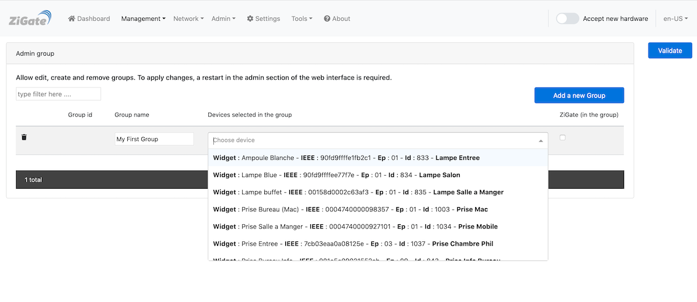
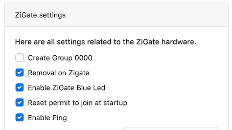

# Tutoriel - Gérer les groupes

## Introduction

Ce tutoriel explique comment gérer les groupes de dispositifs ZigBee directement depuis le plugin de la ZiGate.

Depuis la mise en place de l'interface Web avec la version 4.7 du plugin, la gestion des groupes a été simplifiée. Elle se faisait auparavant principalement en ligne de commande.
Des améliorations ont été apportées avec la version 4.9 pour rendre la gestion des groupes plus facile mais il reste encore du travail pour améliorer l'expérience utilisateur.

## Pré-requis

* Version du firmware de la ZiGate supérieur à 3.0f
* Version du Plugin supérieur à 4.
* Version de DomoticZ supérieur à 2020.1 (avec l'interface web du plugin activé)

## Avant-propos

Le groupe sera gérer directement par les widgets de DomoticZ via les interrupteurs mais pas via les groupes de DomoticZ). Concrètement, pour chaque groupe ZiGate, il y aura un interrupteur dans DomoticZ.

## Méthode

#### Activer la gestion des groupes

* Aller dans la section [Réglages > Paramètres](WebUI_Reglages.md#les-param%C3%A8tres)
* Activer __Activer les Groupes__

#### Vérifier l'existence de groupe

Avant la création d'un groupe, il faut absolument vérifier qu'il n'y a pas déjà des groupes existants dans la ZiGate.

Before creating any group, you must check if there are no existing group already on the network.

* Aller dans la section [Admin > Groupe](WebUI_Admin.md#groupe)
* Lancer une __Analyse complète__

Chaque routeur sera interrogé pour savoir s'il appartient à un groupe.

This will consist in quering each main powered devices for the group membership. As an outcome group could be created and available in the Group Management sub menu.

#### Créer un groupe

* Aller dans la section [Management > Gestion des groupes](WebUI_Management.md#gestion-des-groupes)

* Cliquer sur __Ajouter un groupe__
* Indiquer le nom du groupe
* Sélectionner les dispositifs appartenant au groupe en les cliquant un par un. En cas d'erreur, utiliser la petit croix pour retirer un dispositif de la liste.

Il est possible d'ajouter la ZiGate dans le groupe. Ceci est nécessaire pour récupérer d'une télécommande Ikea.

* Cliquer sur le bouton __Valider__

La demande sera envoyée à chaque dispositif listé. Cela peut prendre quelques secondes.
Si le groupe n'appairait pas, faire rafraîchir la page web.

#### Mettre à jour un groupe

* Aller dans la section [Management > Gestion des groupes](WebUI_Management.md#gestion-des-groupes)
* Cliquer sur le groupe à modifier
* Ajouter ou supprimer des dispositifs
* Cliquer sur le bouton __Valider__

Idem que pour la création d'un groupe, patientez le temps de l'envoi des infos aux dispositifs.

#### Supprimer un groupe

Il y a deux possibilités :

##### Depuis DomoticZ

* Supprimer le widget correspondant au groupe dans DomoticZ

##### Depuis L'interface web du plugin

* Aller dans la section [Management > Gestion des groupes](WebUI_Management.md#gestion-des-groupes)
* Sélectionner le groupe à supprimer
* Cliquer sur la petit icône poubelle à gauche
* Cliquer sur le bouton __Valider__

Idem que pour la création d'un groupe, patientez le temps de l'envoi des infos aux dispositifs.

## Cas particuliers

> Suite en cours de traduction

### Télécommande Ikea

#### Utilisation de la télécommande (appairage)

* Appairer tous les dispositifs séparément dans la ZiGate
* Appairer la télécommande avec chaque ampoule qui fera partie du groupe
* Lancer un scan de groupe
  * Aller dans la section [Admin > Groupe](WebUI_Admin.md#groupe)
  * Lancer une __Analyse complète__
Le groupe sera créer et visible dans [Management > Gestion des groupes](WebUI_Management.md#gestion-des-groupes).

In order to use an IKEA/Tradfri:
1. Pair/Commission each single object to the Zigate (including the remote controller)
1. Pair the Remote Control with each Bulb you want to be part of such group
1. Request a Scan from Admin -> Group and select the Bulb you have paired the remote with
1. The group created will be then visible under the Group Management

##### Récupérer les évènements du groupe

* Ajouter la ZiGate au groupe
* Ajouter la Tradfri 5 buttons au groupe

???

From that stage, you can eventually add Zigate to this group. It will make each remote controller event seen in Zigate.

Additionaly, you can also enable the Left/Right commands of the Tradfri 5 buttons remote controller.

For that you need to edit the Group and add the  Tradfri 5 buttons to that group

#### Création du groupe 0000

If you need to have the group '0000' created, you can enable it via the Settings Advanced

## Avertissements

* Actuellement, quand la ZiGate envoi une commande à un dispositifs ou une liste de dispositifs, il n'y a aucune garantie que les dispositifs ont reçu la commande.
* Il est plus facile de configurer les groupes s'ils sont tous sur On.
* Il est également plus facile d'ajouter des ampoules à un groupe lorsqu'elles sont allumées.

???
* If you want to force a rescan of group membership (like if you have added a new device), you can go to the Admin Group menu and ether request a Full Scan or a selected scan where you will select the devices you want to query
