# Tutoriel - Installation sur Synology avec Docker

Ce tutoriel explique comment installer domoticz et le plugin avec Docker sur un NAS Synology.

## Avant propos
Ce tutoriel suppose que Docker est déjà installé sur votre NAS (Centre de pacquets)

S'il s'agit d'une migration, vous devez :

* Sur la page paremètre, Sauvegarde / restauration, Sauvegarder la base de données
* Copier et sauvegarder le contenu du dossier Data/ du plugin

## Installation de Domoticz

Lancer Docker, vous arrivez sur la Vue d'ensemble.
Cliquer sur Registre :


Cherchez domoticz dans la barre en haut à droite :
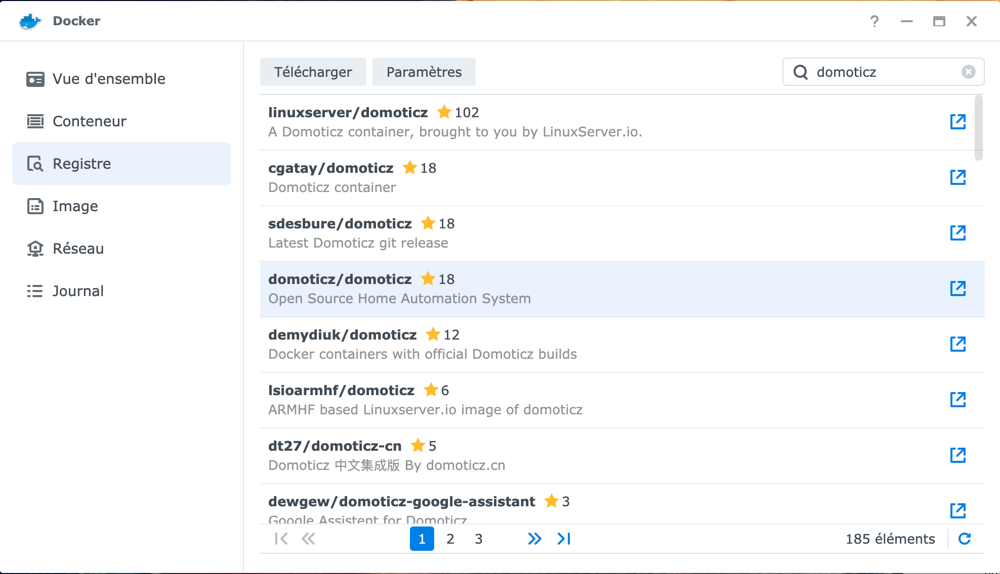


Double cliquez sur l'image souhaité. Je choisis l'officiel, domoticz/domoticz. Il faut choisir sur quelle branche du projet on souhaite être : stable (latest) ou beta.
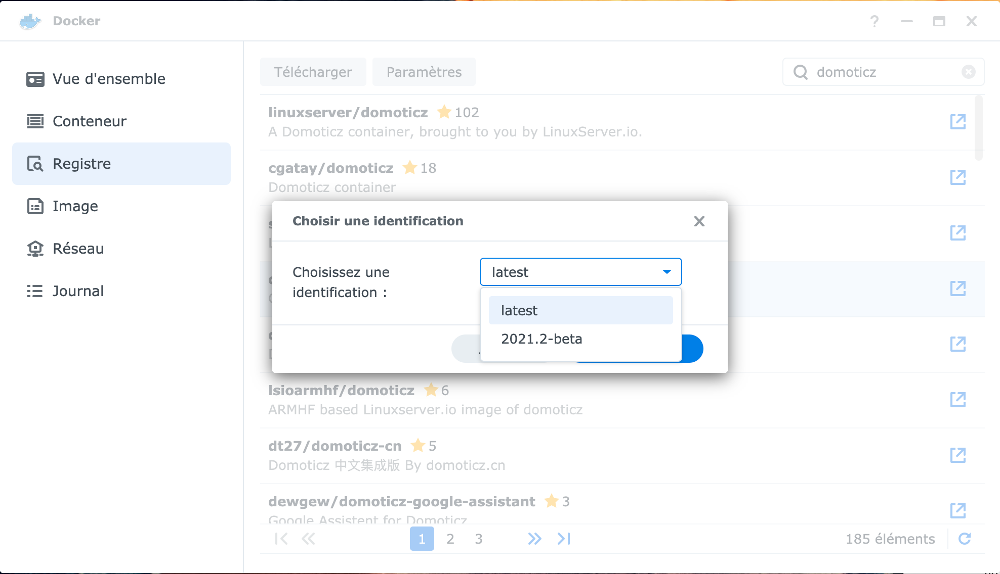


Ensuite, aller dans Image:
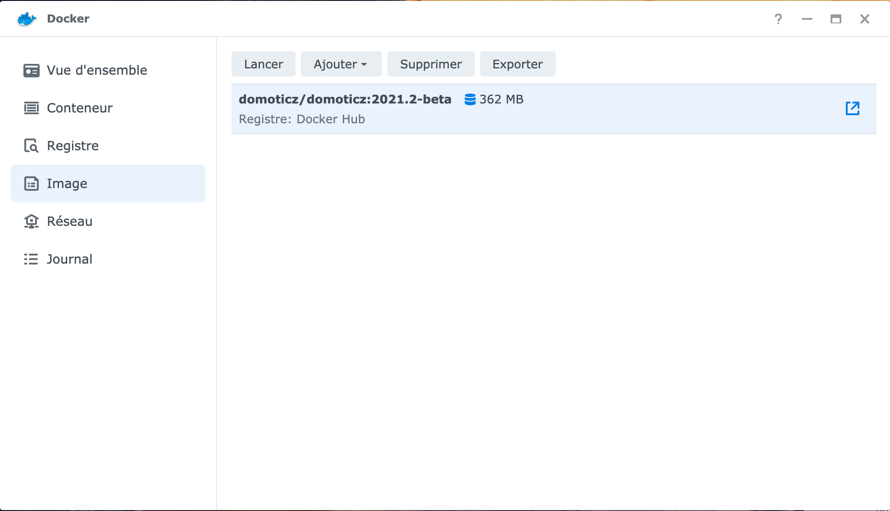


Double cliquer sur l'image domoticz. Nous arrivons dans les paramètres nécessaires à la création du Conteneur. Choisir un nom et cocher "Exécuter le conteneur à l'aide de pirvilèges élevés", puis sélectionner "Paramètres avancés".
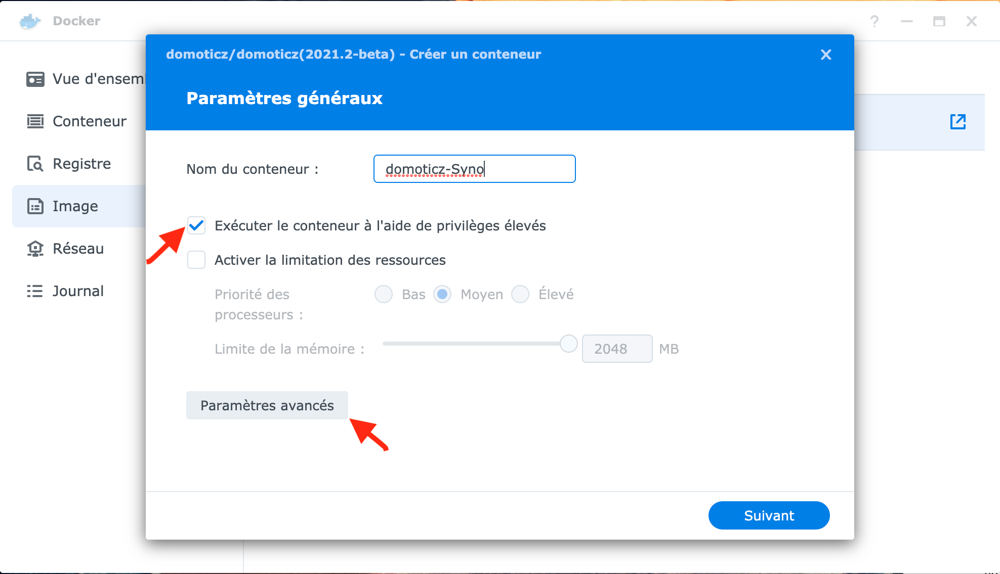


Cocher "Activer le redémarrage automatique", puis aller sur l'onglet Volume.
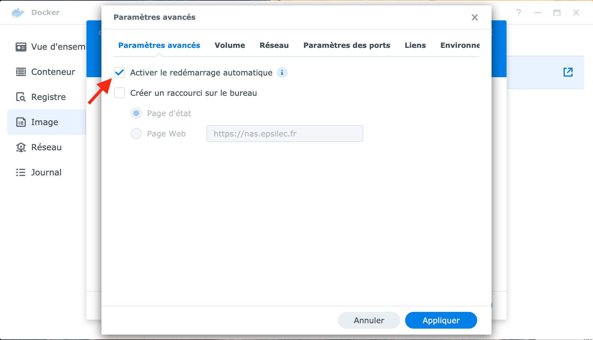


Cette partie est très importante pour le plugin car elle va permette d'avoir accès aux plugins via File Station.
Il faut cliquer sur "Ajouter un dossier".


Selectionner docker puis "Créer dossier" et le nommer domoticz.


Une fois le dossier créé, il faut indiquer le chemin d'accès :
```/opt/domoticz/userdata```
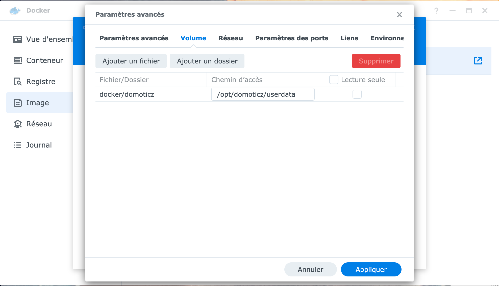


Ensuite, choisir l'onglet Environnement et modifier le port SSL, le port 443 étant déjà utilisé par le NAS, cela va bloquer.


Onglet Paramètres des ports, remplacer auto par les ports choisis:
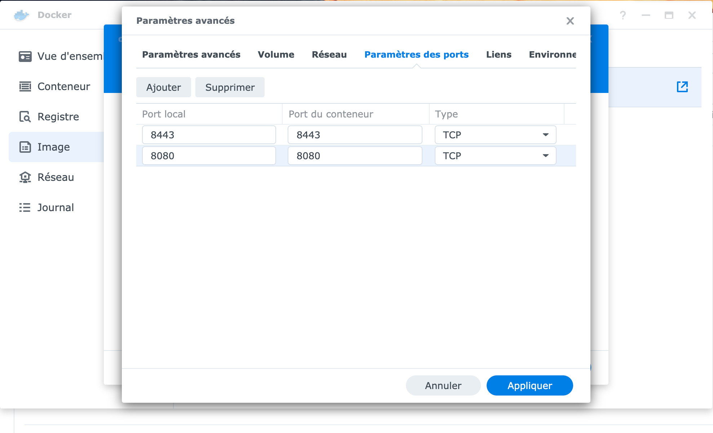


Et voilà, la configuration est faite, appliquer et faire suivant. 
Le dernier écran propose un résumé avant la création du Conteneur : 
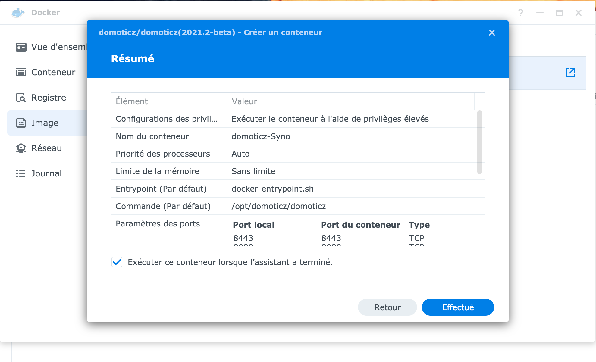


Aller dans l'onglet Conteneur, notre nouveau Conteneur est créé:
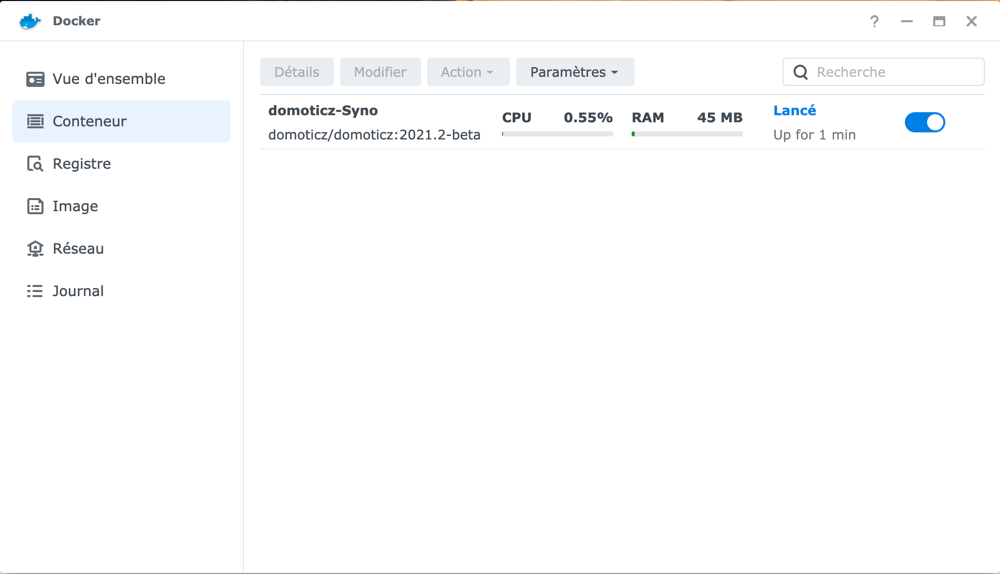


Double cliquer dessus pour accéder aux détails :
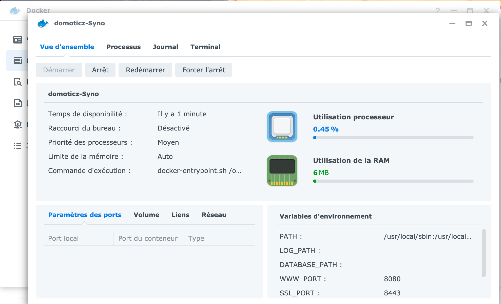


Domoticz est maintenant opérationnel et vous pouvez y accéder.
Un dossier plugins est mainteant créé dans le repertoire docker/domoticz.

## Installation du plugin

Afin de fonctionner, le plugin a besoin de python et celui-ci n'est pas inclus dans l'Image domoticz.
Nous allons donc procéder à son installation. Sur la page Détails du Conteneur domoticz, aller dans l'onglet Terminal.
Créer un nouveau terminal :


Il faut entrer les commandes suivantes et valider par 'Y' si nécessaire:
```
apt update
apt install curl
apt install python
apt install python-requests
```

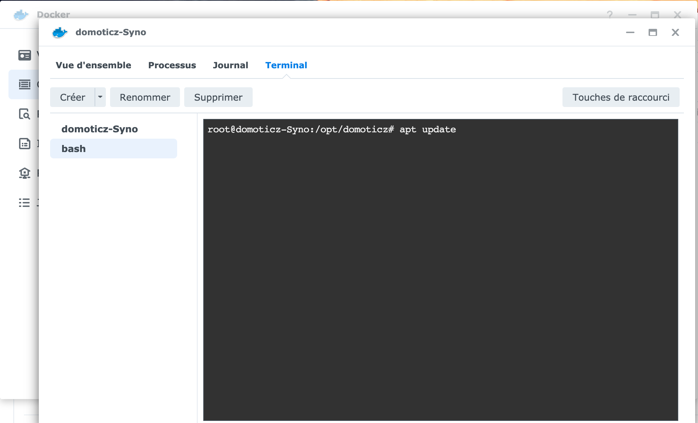

A partir d'ici, deux façons d'installer le plugin :

* Copier le repertoire du plugin directement dans le dossier docker/domoticz/plugin
* Utiliser GIT pour avoir accès au mises à jour


Je ne saurais que conseiller cette deuxième méthode que je détaille ensuite.
Dans le terminal, procéder ainsi :
```
cd userdata
cd plugins
git clone https://github.com/pipiche38/Domoticz-Zigate.git
```


Redémarrer le Conteneur pour que le plugin soit vu par Domoticz.
Le plugin est maintenant installé et peut être ajouté.


S'il s'agit d'une migration, c'est le moment de copier le contenu du dossier Data/ dans /docker/domoticz/plugins/Domoticz-Zigate/Data
Il faut ensuite retourner dans les paramètres de Domoticz et Restaurer la base de données.


