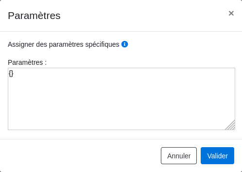

# Tutoriel - Paramétrer les objets

Ce tutoriel explique comment paramétrer spécifiquement certains objets.

## Avant propos

Le plugin dispose de paramètres permettant de personnaliser le fonctionnement des objets ou le fonctionnement du plugin.
Par défaut, un objet certifié est initialisé avec les paramètres par défaut. Il est ensuite possible de personnaliser ces paramètres.

## Méthode

* Aller dans la section [Management > Gestion des objets](WebUI_Gestion.md#gestion-des-objets).
* Filtrer si nécessaire pour trouver l'objet souhaité.
* Cliquer sur la petite icône dans le champ __Paramètres__.
* La fenêtre d'édition de paramètres va s'ouvrir.

*Cette image est susceptible d'avoir évolué depuis l'écriture de cette documentation.*

Il est possible d'éditer le champ paramètres en ajoutant, supprimant ou en mettant à jour les attributs.

Il est important de suivre le formalisme suivant :  { 'parametre1': valeur, 'parametre2': valeur .... }

## Liste des paramètres

| Nom du paramètre | Description | Valeur / Unité | Objet concerné / Paramètre parent |
| ---------------- | ----------- | -------------- | -------------- |
| Calibration    | Permet de définir une valeur de calibration | °C | Tuya eTRV, Eurotronics SPZB0001, Schneider VACT, Danfoss eTRV |
| Alarm1         | Configuration de Alarm1 avec les informations Durée, Volume et Mélodie | { "Duration": X, "Volume": Y, "Melody": Z} | Tuya Siren TS0601 |
| Alarm2         | Configuration de Alarm2 avec les informations Durée, Volume et Mélodie | { "Duration": X, "Volume": Y, "Melody": Z} | Tuya Siren TS0601 |
| Alarm3         | Configuration de Alarm3 avec les informations Durée, Volume et Mélodie | { "Duration": X, "Volume": Y, "Melody": Z} | Tuya Siren TS0601 |
| Alarm4         | Configuration de Alarm4 avec les informations Durée, Volume et Mélodie | { "Duration": X, "Volume": Y, "Melody": Z} | Tuya Siren TS0601 |
| Alarm5         | Configuration de Alarm5 avec les informations Durée, Volume et Mélodie | { "Duration": X, "Volume": Y, "Melody": Z} | Tuya Siren TS0601 |
| Duration       | Durée des Alarmes | Seconde | Paramètre X pour Alarm1, Alarm2, Alarm3, Alarm4 et Alarm5 |
| Volume         | Volume des Alarmes | 0=Fort, 1=Moyen, 2=Faible | Paramètre Y pour Alarm1, Alarm2, Alarm3, Alarm4 et Alarm5 |
| Melody         | Mélodie des Alarmes | de 1 à 15  | Paramètre Z pour Alarm1, Alarm2, Alarm3, Alarm4 et Alarm5 |
| HumidityMinAlarm    | Niveau minimum d'humidité pour déclenchement alarme | % | Tuya Siren TS0601 |
| HumidityMaxAlarm    | Niveau maximum d'humidité pour déclenchement alarme | % | Tuya Siren TS0601 |
| TemperatureMinAlarm | Température minimale pour déclenchement alarme | °C | Tuya Siren TS0601 |
| TemperatureMaxAlarm | Température maximale pour déclenchement alarme | °C | Tuya Siren TS0601 |
| PowerOnAfterOffOn   | Si l'objet est compatible, il se mettra dans l'état défini après une coupure d'alimentation | 0=restera à Off, 1=passera à On, 255=se remettra dans l'état précédent | Ikea, ENki, BlitzWolf plug, Legrand, Philips (une maj des firmware peut être nécessaire) |
| fadingOff     | Durée de transition pour l'extinction . [0] le défaut, transition de 0.8 secondes pour l'extinction, [1] réduction de 50% et attente de 12s avant extinction, [2], 20% de hausse en 0.5 second, puis extinction en 1 seconde, [255] extinction immédiate | Seconde | Toutes les Led variables |
| moveToHueSatu    | Durée de transition pour changer la température de saturation | Dixième de seconde (10=1s) | Toutes les Led variables |
| moveToColourTemp | Durée de transition pour changer la température de couleur | Dixième de seconde (10=1s) | Toutes les Led variables |
| moveToColourRGB  | Durée de transition pour changer la couleur | Dixième de seconde (10=1s) | Toutes les Led variables |
| moveToLevel      | Durée de transition pour faire varier l'intensité lumineuse | Dixième de seconde (10=1s) | Toutes les Led variables |
| occupancySensibility | Sensibilité de la détection pour les détecteurs Philips Hue Motion. 0 Défaut, 1 Haute, 2 Maximum | Philips Hue SML001, SML002 |
| PIROccupiedToUnoccupiedDelay | Le PIROccupiedToUnoccupiedDelay définie le délai, en seconde,avant que le détecteur change son statut à non occupé après la dernière détection de mouvement. | Philips SML001 |
| profaluxOrientBSO | Orientation par défaut des BSO Profalux | Profalux BSO |
| alarmDuration | Durée de sonnerie de l'alarme  | Sirène Bitron |
| OnOffPollingFreq |	Fréquence (en nb de secondes) de rafraîchissement du status On/Off ainsi que le niveau d'intensité. 0 pour désactiver |	Ampoules Gledopto et Philips|
| PowerPollingFreq |	Fréquence (en nb de secondes) de rafraîchissement de la puissance instantanée consommée. 0 pour désactiver |	Prise BlitzWolf et prise Lumi maeu01 |
| AC201Polling |	Polling of AC201 and CAC201 status |	Only for OWON AC201 and Casia CAC201 |

## Exemple

### Exemple de paramètres pour une sirène Tuya TS0601

{
  "Alarm1": { "Duration": 5, "Volume": 2, "Melody": 1},
  "Alarm2": { "Duration": 5, "Volume": 2, "Melody": 2},
  "Alarm3": { "Duration": 5, "Volume": 2, "Melody": 3},
  "Alarm4": { "Duration": 5, "Volume": 2, "Melody": 4},
  "Alarm5": { "Duration": 5, "Volume": 2, "Melody": 5},
  "HumidityMinAlarm": 25,
  "HumidityMaxAlarm": 75,
  "TemperatureMinAlarm": 3,
  "TemperatureMaxAlarm": 27
}

*Cette page est issue d'une traduction : il est possible que le tableau ci-dessus ne soit pas à jour. Se référer à la [page originale](../en-eng/HowTo_Device-parameters.md) en anglais.*
