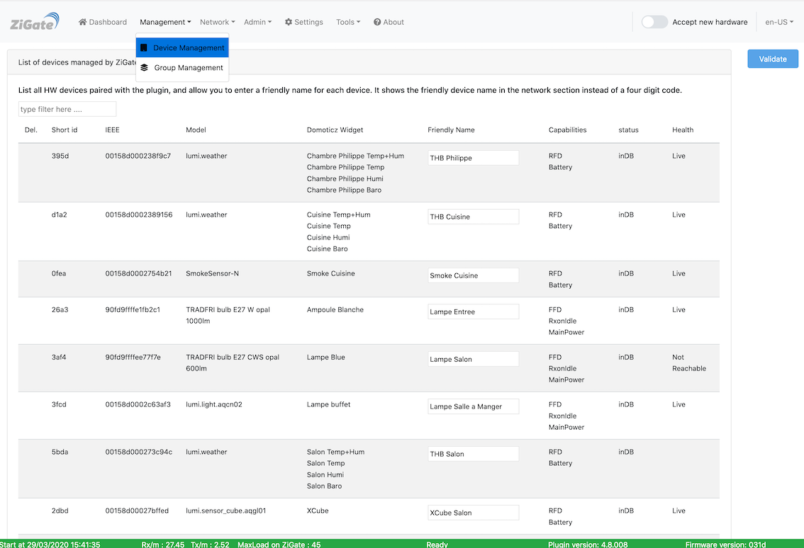

# L'interface Web - La section Management

Pour accéder à l'interface d'administration du plugin, voir l'étape 3 [Configuration du plugin](Configuration.md).

La section __Management__ comporte les pages :

* [Gestion des dispositifs](#gestion-des-dispositifs)
* [Gestion des groupes](#gestion-des-groupes)

------------------------------------------------
## Gestion des dispositifs

Voici la page __Gestion des dispositifs__ de l'interface Web du plugin : 

*Cette page est susceptible d'avoir évolué depuis l'écriture de cette documentation.*

### Utilisation

Cette page permet de lister tous les dispositifs appairés avec le plugin. 

Elle permet :

* D'assigner des surnoms aux dispositifs pour les identifier plus facilement dans l'interface web.
* D'assigner des paramètres aux dispositifs indépendamment les uns des autres.
* De visualiser les informations suivantes pour chaque dispositif :
  * Le ShortId (l'adresse IP du réseau ZigBee) et l'IEEE (l'adesse Mac Address du ZigBee)
  * Le Modèle du dispositif (c'est le type de composant remonté par le dispositif lors de son appairage)
  * Le(s) nom(s) du(des) Widget(s) DomoticZ attaché(s) au dispositif
  * Le surnom donné au sein de cette interface (**Astuce** : donner un surnom identique au nom du widget Domoticz)
  * Les fonctionnalités sur le réseau offertes par le dispositif et son mode d'alimentation : 
  * L'info LQI : cette valeur indique la qualité de la transmission (0 pas de transmission, 255 transmission d'excellente qualité)
  * Le status : inDB (dispositif connu dans la Zigate **et au moins** un widget dans DomoticZ)
  * La Santé du dispositif (present sur le réseau ZigBee ou pas)

------------------------------------------------
## Gestion des groupes

Voici la page __Gestion des groupes__ de l'interface Web du plugin : 

*Cette page est susceptible d'avoir évolué depuis l'écriture de cette documentation.*

### Utilisation

Cette page permet de lister les groupes de dispositifs gérés par le plugin.

------------------------------------------------
Voir les autres pages de l'[interface Web du plugin](Home.md#linterface-web-du-plugin)
