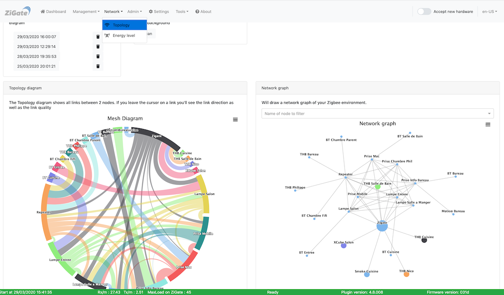

# L'interface Web - La section Réseau

Pour accéder à l'interface d'administration du plugin, voir l'étape 3 [Configuration du plugin](Configuration.md).

La section __Réseau__ comporte les pages :

* [Topologie](#topologie)
* [Niveau d'interférences](#niveau-dinterf%C3%A9rences)

------------------------------------------------
## Topologie

Voici la page __Topologie__ de l'interface Web du plugin : 

*Cette page est sucseptible d'avoir évolué depuis l'écriture de cette documentation.*

### Utilisation

Cette page permet de visualiser le réseau ZigBee. 

Elle permet :

* De visualiser et gérer les différents rapports d'analyse du réseau
* De lancer une analyse du réseau basée sur le LQI (puissance du signal détecté)
  * A noter que le filtrage des packets implémenté dans la ZiGate s'appuie sur la LQI. Un coût supérieur à 5 implique une perte potentielle de paquets

| LQI interval | Cost |
| ---------| -----|
| >= 51 | 1 |
| 46 - 50 | 2 |
| 41 - 45 | 3 |
| 39 - 40 | 4 |
| 36 - 38 | 5 |

**Attention :** Le temps de sortie d'un rapport de topologie est très dépendant de la taille du reseau ZigBee à analyser; plus le nombre de routeurs est important et plus le temps d'analyse sera long.
**A Noter :** Le rapport est egalement diffusé (format texte) dans les logs de DomoticZ

### Description d'un rapport de topologie réseau

Le rapport de topologie réseau est constitué de deux graphiques présentant le maillage et le réseau.

#### Le graphique du maillage

L'illustration de votre maillage montre tous les liens entre dispositifs et ZiGate. 
En déplaçant votre souris sur un lien un pop-up vous indique les composants participant à ce lien ainsi que la qualité de la liaison (LQI) : échelle de 0 (très mauvaise) à 255 (la meilleure).

Un bouton (Chart context menu) en haut à droite du graphique permet de l'afficher en plein écran, de l'imprimer ou de l'exporter sous différent formats.

#### Le graphique du réseau

L'illustration de votre maillage montre l'architecture du réseau ZigBee (les connexions entre les différents dispositifs). 
Vous pouvez visualiser sur quel router est accroché votre dispositif terminal.

Un bouton (Chart context menu) en haut à droite du graphique permet de l'afficher en plein écran, de l'imprimer ou de l'exporter sous différent formats.

#### La liste des dispositifs liés à la ZiGate

Vous retrouvez sous cet item un tableau fournissant des informations relatives aux dispositifs liées à la ZiGate et remontées dans les widgets DomoticZ

------------------------------------------------
## Niveau d'interférences

Voici la page __Niveau d'interférences__ de l'interface Web du plugin : 

*Cette page est susceptible d'avoir évolué depuis l'écriture de cette documentation.*

### Utilisation

Cette page permet de visualiser les niveaux d'interférences par canal du réseau ZigBee.

Elle permet :

* De visualiser et gérer les différents rapports d'interférence du réseau.
* De lancer une analyse des interférences par canal
* De lancer une analyse complète des niveaux d'interférence par canal

### Description d'un rapport de niveau d'interférence

Voir les [explications](ZigBee-et-Wifi.md) sur les interférences entre le Wifi et le ZigBee

Le niveaux d'interférence est calculé avec la communication entre la Zigate et un router. 
Si vous ne disposez pas de router, vous ne pouvez pas faire d'analyse du niveau d'interférence.

Le graphique montre pour chaque canal ZigBee (de 11 à 26) et pour chaque router, le niveau d'interférence lors de la communication avec la Zigate: échelle de 0 (aucune détérioration du signal) à 255 (message inaudible). 

------------------------------------------------
Voir les autres pages de l'[interface Web du plugin](Home.md#linterface-web-du-plugin)
