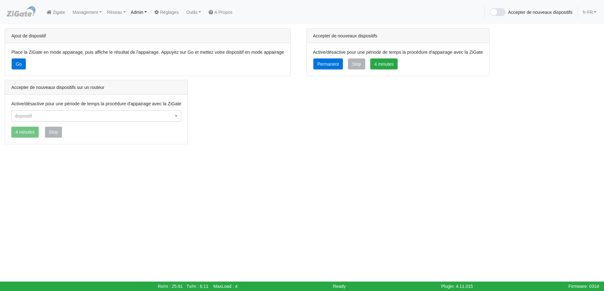

# L'interface Web - La section Admin

Pour accéder à l'interface d'administration du plugin, voir l'étape 3 [Configuration du plugin](Plugin_Configuration.md).

La section __Admin__ comporte les pages :

* [Appairage](#appairage)
* [Groupe](#groupe)
* [ZiGate](#zigate)
* [Plugin](#plugin)
* [Firmware](#firmware)

------------------------------------------------
## Appairage

Voici la page __Appairage__ de l'interface Web du plugin :

*Cette page est susceptible d'avoir évolué depuis l'écriture de cette documentation.*

### Utilisation

Cette page permet d'appairer les dispositifs avec la ZiGate et DomoticZ.

Elle permet :

* D'ajouter un dispositif avec un retour d'info
* D'activer le mode appairage de la ZiGate (permanent ou 4 minutes)
* D'ajouter un dispositif via un routeur particulier

Se reporter à la section [Tutoriels](Home.md#tutoriels) pour plus d'informations.

------------------------------------------------
## Groupe

Voici la page __Groupe__ de l'interface Web du plugin :

*Cette page est susceptible d'avoir évolué depuis l'écriture de cette documentation.*

Le groupe que vous pourrez créer via ce plugin est vu dans DomoticZ comme un unique widget de type Switch et ce indépendamment du nombre de dispositifs composant le groupe.
L'action sur le switch (DomoticZ) sera alors répercutée simultanément sur tous les dispositifs du groupe.

### Utilisation

Cette page permet de gérer les groupes de dispositifs dans la ZiGate.

Elle permet :

* De faire une analyse complète des groupes
* De faire une analyse sélective des groupes

Préalablement à la gestion des groupes, il est nécessaire d'activer la service de groupe (désactivé par défaut) du plugin : Se reporter à la section [Réglages](WebUI_Reglages.md) pour activer les services

Se reporter à la section [Tutoriels](Home.md#tutoriels) pour plus d'informations.

------------------------------------------------
## ZiGate

Voici la page __ZiGate__ de l'interface Web du plugin :

*Cette page est susceptible d'avoir évolué depuis l'écriture de cette documentation.*

### Utilisation

Cette page permet de gérer le fonctionnement du hardware de la ZiGate.

Elle permet :

* De faire un redémarrage logiciel de la ZiGate : Cette action n’entraîne **aucune perte des dispositifs appairés**

Se reporter à la section [Tutoriels](Home.md#tutoriels) pour plus d'informations.

------------------------------------------------
## Plugin

Voici la page __Plugin__ de l'interface Web du plugin :

*Cette page est susceptible d'avoir évolué depuis l'écriture de cette documentation.*

### Utilisation

Cette page permet de gérer le fonctionnement du plugin de la ZiGate.

Elle permet :

* De faire un redémarrage du plugin de la ZiGate

Se reporter à la section [Tutoriels](Home.md#tutoriels) pour plus d'informations.

------------------------------------------------
## Firmware

Voici la page __Firmware__ de l'interface Web du plugin :

*Cette page est susceptible d'avoir évolué depuis l'écriture de cette documentation.*

### Utilisation

Cette page permet de mettre à jour le firmware des dispositifs ZigBee.

Elle permet :

* De faire une mettre à jour le firmware des dispositifs appairés

Se reporter à la section [Tutoriels](Home.md#tutoriels) pour plus d'informations.

------------------------------------------------
Voir les autres pages de l'[interface Web du plugin](Home.md#linterface-web-du-plugin)
