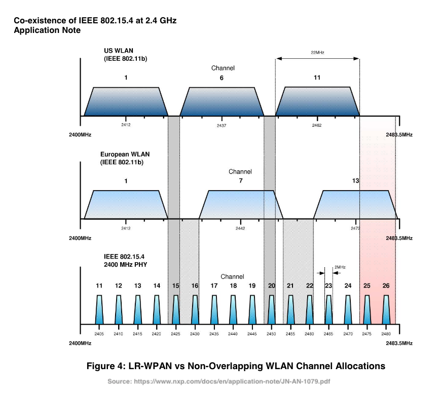

## Configuration

Le canal utilisé pour le réseau ZigBee dans la bande des 2,4 Ghz peut-être configuré dans l'interface d'administration du plugin.

Les réglages possibles sont :

- Défaut : le plugin choisira un canal entre le 11 et le 26. Il peut varier en fonction des performances
- 11 ou 12 ou ... ou 26 : permet de définir un canal fixe

**Pour enregistrer un changement de canal, la Zigate nécessite un redémarrage logiciel**

## 1. Sélection des canaux ZigBee et Wifi

La figure suivante présente la répartition des canaux Wifi US (premier graphique), Wifi Européen (deuxième graphique) et les canaux ZigBee IEEE 802.15.4 (troisième graphique)

Note : on retrouve bien les canaux 11 à 26 qui sont paramétrables.

**La suite des explications sera donnée pour le Wifi Européen**

Un canal wifi (le 7 par exemple) est centré sur une fréquence (2442 MHz pour le canal 7) et occupe une bande 22 MHz (entre 2431 MHz et 2453 MHz pour le canal 7).
Pour le canal 6, la bande est centrée autour de 2437 MHz et s'étend de 2426 à 2448 MHz.

**Pour éviter les interférences, il ne faut pas que les fréquences utilisées par le ZigBee soit dans la plage utilisée par le Wifi.**

Une configuration simple : régler le canal ZigBee sur 11 et le canal wifi sur 11 également. Les bandes de fréquences ZigBee et Wifi étant décalées, il ne devrait pas y avoir d'interférences.

## 2. Séparation physique
Il est recommandé d'avoir une distance de 8m entre votre émetteur wifi (box, router, borne, etc...) et le récepteur ZigBee afin de ne pas dégrader les performances.

## 3. Un réseau maillé

Le protocole ZigBee offre les avantages d'un réseau maillé autogéré dynamiquement : si un router dysfonctionne ou s'il y a une interférence, une autre route est automatique recalculée pour que les données soit transmises.

## 4. Choses à savoir

* Le Zigbee est un réseau à faible puissance contrairement au Wifi. 
Il a été noté que les Caméras IP/Wifi étaient capable de perturber le Zigbee lorsqu'elles étaient en streaming, il faudra donc faire attentionn à l'emplacement des modules Zigbee par rapport aux Wifi et ce même si ils sont sur des cannaux bien séparés

* Beaucoup de problématiques de perte de dispositifs (deconnexion du réseau) sont très souvent liés à un problème d'interferences ou de densité insufisante du réseau Zigbee et l'ajout de dispositifs de type routers est souvent très positif

Plus d'explications : https://www.nxp.com/docs/en/application-note/JN-AN-1079.pdf
